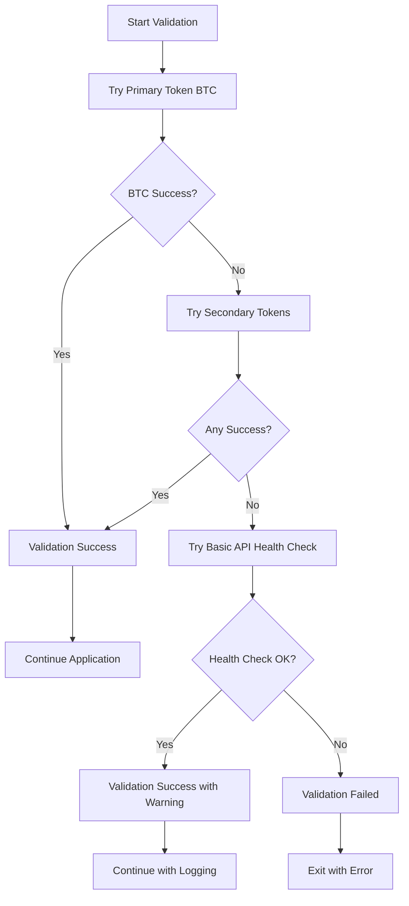

# Design Document

## Overview

The API connection validation fix addresses a critical flaw in the current `validateApiConnection()` method that incorrectly interprets API responses and fails validation even when the ZebPay API is working correctly. The solution implements a more robust validation strategy with multiple fallback approaches and improved error handling to ensure reliable application startup.

## Architecture

The improved validation system uses a multi-tier approach with fallback mechanisms:



## Components and Interfaces

### Enhanced ZebPayClient Validation

The current validation method will be replaced with a more robust approach:

```typescript
interface ValidationResult {
  success: boolean;
  method: "primary" | "fallback" | "health-check";
  testedTokens: string[];
  errors: ValidationError[];
  warnings?: string[];
}

interface ValidationError {
  token: string;
  error: string;
  statusCode?: number;
  timestamp: Date;
}

class ZebPayClient {
  async validateApiConnection(): Promise<ValidationResult> {
    // Multi-tier validation approach
  }

  private async validateWithToken(symbol: string): Promise<boolean> {
    // Single token validation
  }

  private async validateWithMultipleTokens(
    symbols: string[]
  ): Promise<ValidationResult> {
    // Try multiple tokens for validation
  }

  private async performBasicHealthCheck(): Promise<boolean> {
    // Basic API endpoint availability check
  }
}
```

### Improved Error Handling

The error handling will be enhanced to provide better diagnostics:

```typescript
interface ApiValidationError extends Error {
  type:
    | "NETWORK_ERROR"
    | "TOKEN_NOT_FOUND"
    | "API_ERROR"
    | "TIMEOUT"
    | "RATE_LIMIT";
  statusCode?: number;
  token?: string;
  retryable: boolean;
  context: {
    attempt: number;
    timestamp: Date;
    endpoint: string;
  };
}

class ValidationErrorHandler {
  categorizeError(error: any, token: string): ApiValidationError {
    // Improved error categorization logic
  }

  isRetryableError(error: ApiValidationError): boolean {
    // Determine if error warrants retry
  }

  shouldTryAlternativeValidation(errors: ApiValidationError[]): boolean {
    // Decide if alternative validation methods should be attempted
  }
}
```

## Data Models

### Validation Configuration

```typescript
interface ValidationConfig {
  primaryToken: string;
  fallbackTokens: string[];
  maxRetries: number;
  retryDelay: number;
  timeout: number;
  healthCheckEndpoint?: string;
}

// Default configuration
const DEFAULT_VALIDATION_CONFIG: ValidationConfig = {
  primaryToken: "BTC",
  fallbackTokens: ["ETH", "USDT", "TRX"], // Common tokens likely to be available
  maxRetries: 2,
  retryDelay: 1000,
  timeout: 5000,
  healthCheckEndpoint: "/ticker", // Generic endpoint check
};
```

### Enhanced API Response Handling

```typescript
interface ZebPayResponse {
  success: boolean;
  data?: any;
  error?: {
    code: string;
    message: string;
    statusCode: number;
  };
}

class ResponseValidator {
  validatePriceResponse(response: any): boolean {
    // Validate that response contains expected price data
    return (
      response &&
      typeof response.buy === "string" &&
      !isNaN(parseFloat(response.buy)) &&
      parseFloat(response.buy) > 0
    );
  }

  isTokenNotFoundError(error: any): boolean {
    // More accurate detection of token not found vs other errors
    return (
      error.response?.status === 404 &&
      error.response?.data?.message?.includes("not found")
    );
  }
}
```

## Error Handling

### Validation Strategy Implementation

The new validation approach will follow this logic:

1. **Primary Validation**: Try BTC token first (most common)
2. **Fallback Validation**: If BTC fails, try other common tokens (ETH, USDT, TRX)
3. **Health Check**: If all token validations fail, try a basic API health check
4. **Graceful Degradation**: Allow application to continue with warnings if API is partially functional

```typescript
class EnhancedApiValidator {
  async validateApiConnection(): Promise<ValidationResult> {
    const result: ValidationResult = {
      success: false,
      method: "primary",
      testedTokens: [],
      errors: [],
    };

    // Step 1: Try primary token
    try {
      const primarySuccess = await this.validateWithToken(
        this.config.primaryToken
      );
      if (primarySuccess) {
        result.success = true;
        result.method = "primary";
        result.testedTokens = [this.config.primaryToken];
        return result;
      }
    } catch (error) {
      result.errors.push(
        this.categorizeValidationError(error, this.config.primaryToken)
      );
    }

    // Step 2: Try fallback tokens
    for (const token of this.config.fallbackTokens) {
      try {
        const success = await this.validateWithToken(token);
        if (success) {
          result.success = true;
          result.method = "fallback";
          result.testedTokens.push(token);
          result.warnings = [
            `Primary validation token ${this.config.primaryToken} failed, but ${token} succeeded`,
          ];
          return result;
        }
      } catch (error) {
        result.errors.push(this.categorizeValidationError(error, token));
        result.testedTokens.push(token);
      }
    }

    // Step 3: Basic health check
    try {
      const healthOk = await this.performBasicHealthCheck();
      if (healthOk) {
        result.success = true;
        result.method = "health-check";
        result.warnings = [
          "Token validation failed but API appears to be accessible",
        ];
        return result;
      }
    } catch (error) {
      result.errors.push({
        token: "health-check",
        error: error.message,
        timestamp: new Date(),
      });
    }

    return result;
  }
}
```

### Error Categorization Logic

```typescript
private categorizeValidationError(error: any, token: string): ValidationError {
  const baseError: ValidationError = {
    token,
    error: error.message,
    timestamp: new Date()
  };

  if (error.response) {
    baseError.statusCode = error.response.status;

    // More accurate error categorization
    if (error.response.status === 404) {
      // Check if it's actually a token not found or API endpoint issue
      const responseText = error.response.data?.message || '';
      if (responseText.includes('not found') || responseText.includes('invalid symbol')) {
        baseError.error = `Token ${token} not available on ZebPay`;
      } else {
        baseError.error = `API endpoint not found (possible API change)`;
      }
    } else if (error.response.status === 429) {
      baseError.error = `Rate limit exceeded for ${token}`;
    } else if (error.response.status >= 500) {
      baseError.error = `ZebPay server error for ${token}`;
    }
  } else if (error.code === 'ECONNABORTED' || error.code === 'ETIMEDOUT') {
    baseError.error = `Timeout while validating ${token}`;
  } else {
    baseError.error = `Network error while validating ${token}: ${error.message}`;
  }

  return baseError;
}
```

## Testing Strategy

### Unit Testing

1. **Validation Logic Tests**: Test each validation tier independently
2. **Error Handling Tests**: Verify correct error categorization and handling
3. **Fallback Mechanism Tests**: Ensure fallback tokens are tried correctly
4. **Response Validation Tests**: Test response parsing and validation logic

### Integration Testing

1. **API Connectivity Tests**: Test with actual ZebPay API responses
2. **Error Scenario Tests**: Simulate various API failure conditions
3. **Performance Tests**: Ensure validation completes within reasonable time
4. **Resilience Tests**: Test behavior under intermittent connectivity issues

### Test Scenarios

```typescript
describe("Enhanced API Validation", () => {
  test("should succeed with primary token when BTC is available", async () => {
    // Mock successful BTC response
    const result = await validator.validateApiConnection();
    expect(result.success).toBe(true);
    expect(result.method).toBe("primary");
  });

  test("should fallback to secondary tokens when BTC fails", async () => {
    // Mock BTC failure, ETH success
    const result = await validator.validateApiConnection();
    expect(result.success).toBe(true);
    expect(result.method).toBe("fallback");
    expect(result.warnings).toContain("Primary validation token BTC failed");
  });

  test("should use health check when all tokens fail", async () => {
    // Mock all token failures, health check success
    const result = await validator.validateApiConnection();
    expect(result.success).toBe(true);
    expect(result.method).toBe("health-check");
  });

  test("should fail gracefully when API is completely unavailable", async () => {
    // Mock complete API failure
    const result = await validator.validateApiConnection();
    expect(result.success).toBe(false);
    expect(result.errors.length).toBeGreaterThan(0);
  });
});
```

## Implementation Architecture

### File Changes Required

1. **src/api/zebpay-client.ts**: Update validation method and error handling
2. **src/api/api-types.ts**: Add new interfaces for validation results
3. **src/main.ts**: Update validation result handling
4. **src/config/tokens.json**: Add validation configuration section

### Configuration Updates

The tokens.json file will be extended with validation settings:

```json
{
  "tokens": {
    /* existing token config */
  },
  "api": {
    "baseUrl": "https://api.zebpay.com",
    "timeout": 10000,
    "retryAttempts": 3,
    "validation": {
      "primaryToken": "BTC",
      "fallbackTokens": ["ETH", "USDT", "TRX"],
      "maxRetries": 2,
      "retryDelay": 1000,
      "timeout": 5000
    }
  },
  "table": {
    /* existing table config */
  }
}
```

### Logging Improvements

Enhanced logging will provide better visibility into validation process:

```typescript
class ValidationLogger {
  logValidationStart(): void {
    console.log("🔗 Starting API connection validation...");
  }

  logValidationSuccess(result: ValidationResult): void {
    if (result.method === "primary") {
      console.log("✅ API validation successful with primary token");
    } else {
      console.log(`✅ API validation successful using ${result.method} method`);
      if (result.warnings) {
        result.warnings.forEach((warning) => console.warn(`⚠️  ${warning}`));
      }
    }
  }

  logValidationFailure(result: ValidationResult): void {
    console.error("❌ API validation failed");
    result.errors.forEach((error) => {
      console.error(`   ${error.token}: ${error.error}`);
    });
  }
}
```

This design ensures that the API validation becomes more robust and provides better error reporting while maintaining backward compatibility with the existing codebase.
