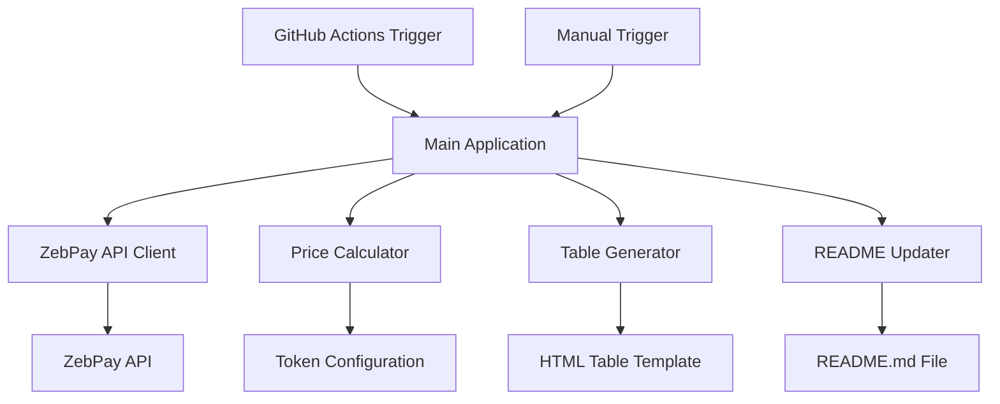

# Design Document

## Overview

The crypto price tracker is a Node.js application that integrates with the ZebPay API to fetch real-time cryptocurrency prices in INR, processes fixed token amounts, and generates a sortable HTML table within a README.md file. The system uses GitHub Actions for automated weekly updates and provides manual refresh capabilities.

## Architecture

The application follows a modular architecture with clear separation of concerns:



### Core Components

1. **API Client**: Handles ZebPay API communication with retry logic and error handling
2. **Price Calculator**: Converts token amounts to INR values and calculates withdrawal fees
3. **Table Generator**: Creates sortable HTML tables with JavaScript functionality
4. **README Updater**: Manages README.md file updates while preserving existing content
5. **Configuration Manager**: Handles token lists and application settings

## Components and Interfaces

### ZebPay API Client

```typescript
interface ZebPayClient {
  fetchTokenPrice(symbol: string): Promise<TokenPrice>;
  fetchWithdrawalFees(symbol: string): Promise<WithdrawalFees>;
  validateApiConnection(): Promise<boolean>;
}

interface TokenPrice {
  symbol: string;
  price: number;
  currency: "INR";
  timestamp: Date;
}

interface WithdrawalFees {
  symbol: string;
  nativeFee: number;
  inrFee: number;
}
```

### Price Calculator

```typescript
interface PriceCalculator {
  calculateInrValue(tokenAmount: number, price: number): number;
  calculateWithdrawalFeesInr(nativeFee: number, tokenPrice: number): number;
  processTokenData(tokens: TokenConfig[]): Promise<ProcessedToken[]>;
}

interface TokenConfig {
  symbol: string;
  amount: number;
  name: string;
}

interface ProcessedToken {
  name: string;
  symbol: string;
  price: number;
  amount: number;
  inrValue: number;
  withdrawalFeeNative: number;
  withdrawalFeeInr: number;
}
```

### Table Generator

```typescript
interface TableGenerator {
  generateSortableTable(tokens: ProcessedToken[]): string;
  createTableHeader(): string;
  createTableRows(tokens: ProcessedToken[]): string;
  addSortingScript(): string;
}
```

### README Updater

```typescript
interface ReadmeUpdater {
  updatePriceTable(tableHtml: string): Promise<void>;
  preserveExistingContent(newTable: string): Promise<string>;
  findTableSection(): { start: number; end: number } | null;
}
```

## Data Models

### Configuration File Structure

```json
{
  "tokens": [
    {
      "symbol": "BTC",
      "name": "Bitcoin",
      "amount": 0.1
    },
    {
      "symbol": "ETH",
      "name": "Ethereum",
      "amount": 1.0
    }
  ],
  "api": {
    "baseUrl": "https://api.zebpay.com",
    "timeout": 10000,
    "retryAttempts": 3
  },
  "table": {
    "refreshButtonText": "🔄 Refresh Prices",
    "lastUpdatedFormat": "DD/MM/YYYY HH:mm:ss"
  }
}
```

### ZebPay API Response Models

Based on ZebPay API documentation, the expected response structure:

```typescript
interface ZebPayPriceResponse {
  market: string;
  buy: string;
  sell: string;
  volume: string;
  timestamp: number;
}

interface ZebPayWithdrawalResponse {
  currency: string;
  fee: string;
  minimum: string;
  maximum: string;
}
```

## Error Handling

### API Error Handling Strategy

1. **Network Errors**: Implement exponential backoff retry mechanism
2. **Rate Limiting**: Respect API rate limits with appropriate delays
3. **Invalid Responses**: Validate API responses and handle malformed data
4. **Authentication Errors**: Handle API key issues gracefully

```typescript
class ApiErrorHandler {
  async handleApiError(error: ApiError): Promise<void> {
    switch (error.type) {
      case "RATE_LIMIT":
        await this.waitForRateLimit(error.retryAfter);
        break;
      case "NETWORK_ERROR":
        await this.retryWithBackoff(error.attempt);
        break;
      case "INVALID_RESPONSE":
        this.logError(error);
        throw new ProcessingError("Invalid API response");
      default:
        this.logError(error);
        throw error;
    }
  }
}
```

### File Operation Error Handling

1. **README.md Access**: Handle file permission and existence issues
2. **Backup Strategy**: Create backups before modifying README.md
3. **Atomic Updates**: Ensure README.md updates are atomic to prevent corruption

## Testing Strategy

### Unit Testing

1. **API Client Tests**: Mock ZebPay API responses for various scenarios
2. **Calculator Tests**: Verify price calculations and fee conversions
3. **Table Generator Tests**: Validate HTML output and sorting functionality
4. **README Updater Tests**: Test content preservation and table replacement

### Integration Testing

1. **End-to-End Flow**: Test complete workflow from API fetch to README update
2. **GitHub Actions Testing**: Validate automation workflow execution
3. **Error Scenario Testing**: Test behavior under various failure conditions

### Test Data Strategy

```typescript
const mockTokenData = {
  BTC: {
    price: 4500000, // 45 lakh INR
    withdrawalFee: 0.0005,
    withdrawalFeeInr: 2250,
  },
  ETH: {
    price: 350000, // 3.5 lakh INR
    withdrawalFee: 0.01,
    withdrawalFeeInr: 3500,
  },
};
```

## Implementation Architecture

### File Structure

```
crypto-price-tracker/
├── src/
│   ├── api/
│   │   ├── zebpay-client.ts
│   │   └── api-types.ts
│   ├── calculator/
│   │   └── price-calculator.ts
│   ├── table/
│   │   ├── table-generator.ts
│   │   └── table-template.html
│   ├── updater/
│   │   └── readme-updater.ts
│   ├── config/
│   │   └── tokens.json
│   └── main.ts
├── tests/
│   ├── unit/
│   └── integration/
├── .github/
│   └── workflows/
│       └── update-prices.yml
├── package.json
├── tsconfig.json
└── README.md
```

### GitHub Actions Workflow

The automation will use GitHub Actions with the following trigger conditions:

1. **Scheduled**: Weekly cron job (every Sunday at 00:00 UTC)
2. **Manual**: Workflow dispatch for on-demand updates
3. **Repository Events**: Optional trigger on push to main branch

### Sortable Table Implementation

The generated table will include embedded JavaScript for client-side sorting:

1. **Click Handlers**: Attach click events to table headers
2. **Sort Logic**: Implement numeric and alphabetic sorting algorithms
3. **Visual Indicators**: Show sort direction with arrow icons
4. **State Persistence**: Remember last sort preference in localStorage

### Security Considerations

1. **API Keys**: Store ZebPay API credentials as GitHub Secrets
2. **Input Validation**: Sanitize all external data before processing
3. **Rate Limiting**: Implement client-side rate limiting to respect API limits
4. **Error Logging**: Avoid logging sensitive information in error messages
